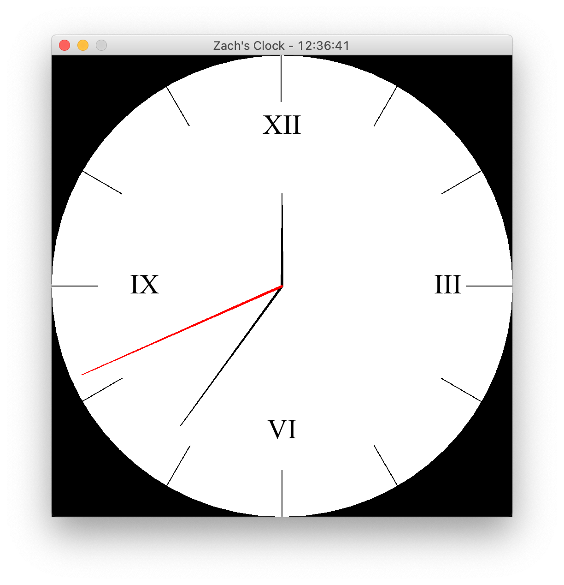

# ClockProject

This project can create an analog clock that tells time, utilizing basic geometry to calculate the angles of each hand, and Java's Calendar object to maintain the current time. Below you can see an image of the program running.

Clicking on the panel itself toggles the digital clock that can be seen in the title of the frame in the above screenshot.
